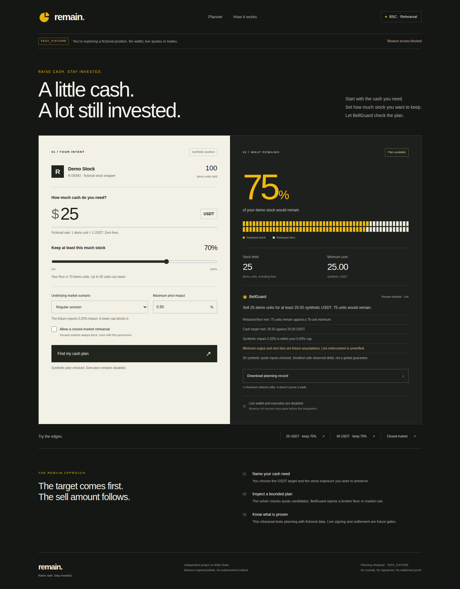

# Remain

Raise cash. Stay invested.

Remain works backward from a USDT cash target to a bounded partial sale of a tokenized-stock position on BNB Smart Chain. BellGuard checks market state, quote freshness and user limits. The intended result is a reconciled settlement receipt showing cash received and exposure retained.

## Current state

Milestone 0 feasibility kit, Milestone 1's standalone cash solver and BellGuard, Milestone 2's interactive planning rehearsal, Milestone 3's standalone fixture order journal and settlement checks, and Milestone 4's canonical fixture proof receipt with an independent verifier. Execution is disabled. There is no live wallet flow or deployed trading product. The interface uses an explicitly fictional position and the actual planning engine. GitHub and owner-reported local discovery both returned Binance compliance code 40304. A successful discovery and held-stock RFQ check are still required before live integration. See [milestone status](docs/milestone-status.md) and [access troubleshooting](docs/access-troubleshooting.md).

This repo stays private until the owner approves public release. Nothing here is financial advice or a claim of Binance endorsement.



[Mobile rehearsal screenshot](docs/assets/planning-mobile.png). Both images use fictional data.

## Local verification

Requires Node.js 24 and npm.

```sh
npm ci
npm run verify
npm run test:coverage
```

The kit includes exact-byte HMAC signing, a read-only endpoint allowlist, bounded responses and retries, input/schema validation, synthetic adversarial tests and sanitized evidence reports. No wallet-signing or trade-submission methods exist.

## Cash-planning rehearsal

Open the interactive interface without API credentials or a wallet:

```sh
npm run dev
```

Visit `http://127.0.0.1:3000`. Enter a cash target, choose a retained floor and test regular, closed or paused market scenarios. BellGuard shows a bounded synthetic result. Changing an input clears the old result. The inspection window expires after 15 seconds. Downloads are labelled synthetic planning records, never settlement receipts. An original textless mark and graphite, cream and Binance-inspired yellow define the interface. Read the [interface contract](docs/planning-interface.md).

For automated browser verification, install its pinned development-only browser tool first:

```sh
npx --yes agent-browser@0.38.2 install
npm run test:web
```

On Linux, browser system dependencies may require `install --with-deps`. This tool is isolated from the production dependency tree. GitHub CI installs it, tests the real browser flow and uploads five labelled synthetic screenshots. The rehearsal server binds to loopback and must not be exposed as a production trading backend.

For a terminal-only rehearsal:

```sh
npm run rehearse:plan
```

This synthetic rehearsal raises a 25 USDT target while preserving a token floor, rejects an unreachable 40 USDT target and blocks a closed market without permission. It uses no API keys, HTTP requests or wallet. The planning engine handles exact integer units, cash and stock fee bounds, quote search budgets, stale facts, cancellation and immutable evidence. It selects the smallest safe total debit observed, never claims a globally minimal fill and always disables execution. Read the [planning contract and limitations](docs/planning-engine.md) before integrating it.

## Order recovery and settlement rehearsal

```sh
npm run rehearse:orders
```

This standalone backend rehearsal binds a passing fixture plan, persists an uncertain attempt in SQLite, reopens it with the same request ID, observes a fictional fill and independently checks its fictional transfer/balance evidence. A later fictional reorg invalidates the match. The temporary database is removed. There are no network calls or browser order controls. Read the [journal contract, invariants and storage limitations](docs/order-journal.md). Synthetic matches never establish a settled mainnet trade.

## Live discovery and feasibility

Apply for a Web3 API key at [Binance developer portal](https://web3.binance.com/en/dev-portal). Keep both credentials outside git. Put these in an ignored local `.env.local`, or GitHub Actions secrets:

- `BINANCE_WEB3_API_KEY`
- `BINANCE_WEB3_SECRET_KEY`

First discover supported public stock metadata. This requires only those two credentials:

```sh
npm run discover:binance
```

Then configure these three non-secret values locally or in GitHub Actions repository variables:

- `REMAIN_WALLET_ADDRESS`: your public BSC wallet address. Never a key or seed.
- `REMAIN_RWA_TOKEN_ADDRESS`: a supported BSC stock contract returned by discovery, already held by this wallet.
- `REMAIN_SELL_AMOUNT_RAW`: positive integer raw-token units within that balance. Calculate using that token's observed decimals, never assume 18.

```sh
npm run smoke:binance
```

Smoke reads chain support, stock metadata, market state and holdings, requests a stock-to-USDT RFQ quote and builds an unsigned payload. It requires inspectable EIP-712 structure. It never approves, signs, submits or broadcasts. Evidence lands in ignored `evidence/` with private file permissions. This gate proves read-only feasibility only. Semantic order verification, signature safety, settlement and live trades are later gates.

GitHub has a manual **Binance read-only feasibility** workflow with `discover` and `feasibility` modes on `main`. It offers `github-hosted` or an owner-configured `self-hosted` runner with label `remain-feasibility`. Use only a host authorized for Binance's service. Automated CI never receives Binance secrets. The manual workflow rejects missing configuration before networking and stops on compliance errors. Both modes preserve sanitized evidence even when they fail. Public discovery output contains only selected public token metadata. Smoke artifacts contain hashes and checks, never wallets, balances or raw payloads. Do not share an artifact as a settlement receipt.

## Plan and evidence

- [Build blueprint](docs/build-plan.md)
- [Product lock](docs/product-lock.md)
- [Security boundaries](docs/security.md)
- [Planning engine](docs/planning-engine.md)
- [Planning interface](docs/planning-interface.md)
- [Order journal and settlement rehearsal](docs/order-journal.md)
- [Developer experience log](docs/devex-log.md)

The dependency lockfile is committed. `npm run check:security` is a small source-policy check, not a security audit. No deployed custom contracts exist at this milestone.
